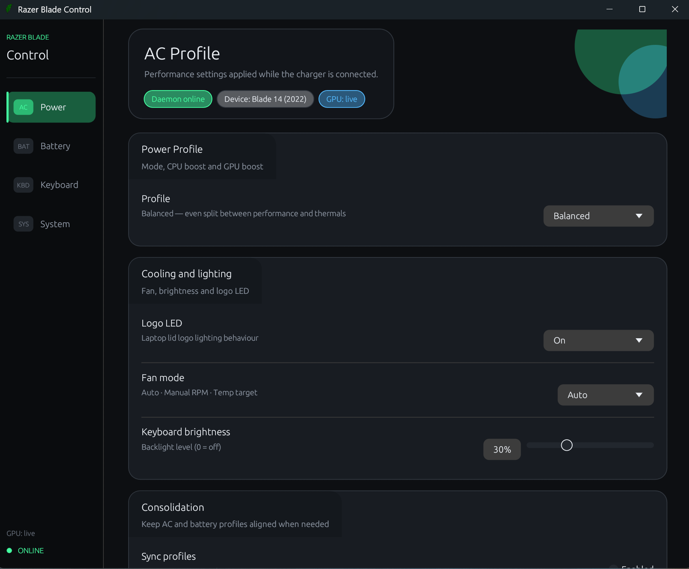
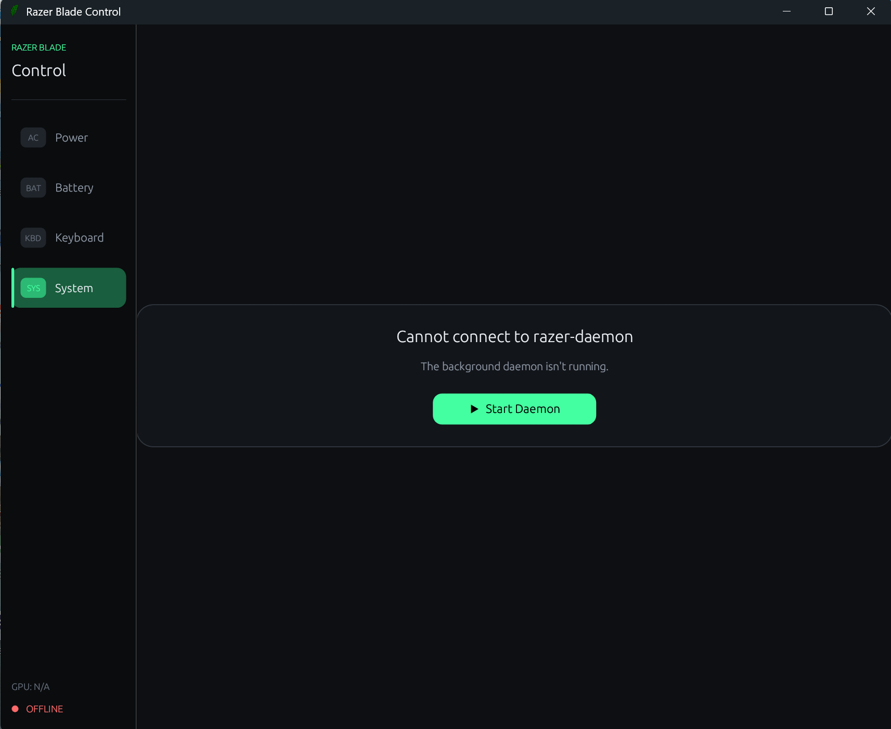

<div align="centre">
  
</div>

# Razer Blade Control

A lightweight, open-source alternative to Razer Synapse for Razer Blade laptops on Windows.

Synapse is heavy, cloud-tied, and increasingly drops support for older hardware. This is a small
native app that controls the same things locally: keyboard lighting, power and fan profiles,
battery behaviour, and the Fn/media key row — with no accounts, no telemetry and no background bloat.

> **Status: experimental.** It only works on Razer models whose hardware IDs it recognises.
> If your laptop isn't supported it simply won't connect — it won't damage anything. See
> [Compatibility](#compatibility).

---

## Screenshots

### Main control window

The Power tab, connected and running. The status chips along the top show daemon state, the
detected laptop model and live GPU telemetry. From here you can set the performance profile,
lid logo LED, fan mode and keyboard backlight brightness — with separate profiles for AC and
battery power.



### When the background service isn't running

The app is split into a GUI and a small background service (the "daemon") that does the actual
hardware work, because talking to the keyboard and power controller needs Administrator rights.
If the daemon isn't running, the GUI shows this screen — one click on **Start Daemon** brings it
up (Windows will ask for permission via UAC).



---

## Features

- **Keyboard lighting** — static colours, animated effects, per-effect settings, live preview
- **Power profiles** — balanced / performance / custom, with independent AC and battery profiles
- **Fan control** — auto, manual RPM, or temperature target
- **Battery care** — charge limits and low-battery behaviour
- **Fn row / media keys** — use F1–F12 as media keys without holding Fn (persists across restarts)
- **GPU monitoring** — utilisation, VRAM, temperature and power draw, without keeping the dGPU awake
- **Runs quietly** — small tray app; the daemon can auto-start at logon

---

## Compatibility

This is the honest part. The daemon only recognises specific Razer models.

| Model | Status |
| --- | --- |
| Blade 14 (2022) — RZ09-0427 | Confirmed working |
| Blade 16 (2023) — RZ09-0483 | Upstream development hardware |
| Other Razer Blade models | Untested — reports welcome |

**Requirements**

- Windows 10 or 11, 64-bit
- Administrator rights (the daemon needs direct HID access)
- **Razer Synapse must be closed or uninstalled** — it holds the hardware and will fight this app

If you try it on an unlisted model, please open an issue with your model number and what did or
didn't work. That's the fastest way to grow the table above.

---

## Install

### Option 1 — download a release (easiest)

Grab the latest **installer** or **portable zip** from the
[Releases](../../releases) page, then run `razer-gui.exe`. The daemon starts automatically
(approve the UAC prompt) and the GUI connects on its own.

Because the app isn't code-signed, Windows SmartScreen will show a warning the first time:
click **More info → Run anyway**. The full source is here if you'd like to inspect it first.

### Option 2 — build from source

You'll need the [Rust toolchain](https://rustup.rs/) (MSVC target) and the Visual Studio Build
Tools with the C++ workload.

```sh
git clone https://github.com/aiaiaioh/razer-control-win.git
cd razer-control-win
cargo build --release
```

Binaries land in `target/release/`:

| Binary | Purpose |
| --- | --- |
| `razer-gui.exe` | The control window / tray app |
| `razer-daemon.exe` | Background service that talks to the hardware (needs admin) |
| `razer-cli.exe` | Command-line control, useful for scripting and debugging |

Run `razer-gui.exe` — it will start the daemon for you.

---

## Packaging a release

`package.ps1` builds everything and produces both distributables in one step:

```powershell
powershell -ExecutionPolicy Bypass -File .\package.ps1
```

It reads the version from `Cargo.toml`, stops any running instances, builds, then writes to `dist/`:

- `RazerBladeControl-v<version>-portable.zip`
- `RazerBladeControl-v<version>-setup.exe` (requires [Inno Setup](https://jrsoftware.org/isdl.php))

---

## How it works

Three binaries talk over a local TCP socket (`127.0.0.1:29494`) using bincode:

```
razer-daemon  ←── IPC ──→  razer-gui / razer-cli
     │
     ├── kbd/      HID keyboard control (brightness, effects)
     ├── power.rs  ACPI power profiles
     ├── gpu.rs    GPU telemetry (NVML, with PDH fallback)
     └── input.rs  Low-level keyboard hook (Fn row, gaming mode)
```

Only the daemon runs elevated; the GUI runs as a normal user. Settings are stored in
`%APPDATA%\razercontrol`. See [`docs/MEMO.md`](docs/MEMO.md) for deeper architecture notes.

---

## Credits

This project is built on [**Kraven1109/razer-control-win**](https://github.com/Kraven1109/razer-control-win),
which provided the core daemon, HID protocol implementation and device database. Full credit for
that groundwork goes to its author.

This fork focuses on making the tool usable by non-developers: a reworked GUI, daemon start/stop
controls, persistent Fn-row settings, automatic daemon startup, and prebuilt installers so that
no build toolchain is required.

Thanks also to the wider Razer-on-Linux reverse-engineering community, whose documentation of
Razer's HID protocol made projects like this possible.

---

## License

⚠️ **To be confirmed.** The upstream project does not currently publish a licence file, which
means its code is by default "all rights reserved". A licence for this repository will be added
once that has been clarified with the upstream author.

---

## Disclaimer

Not affiliated with, endorsed by, or supported by Razer Inc. "Razer" and "Blade" are trademarks
of their respective owner. Use at your own risk.
